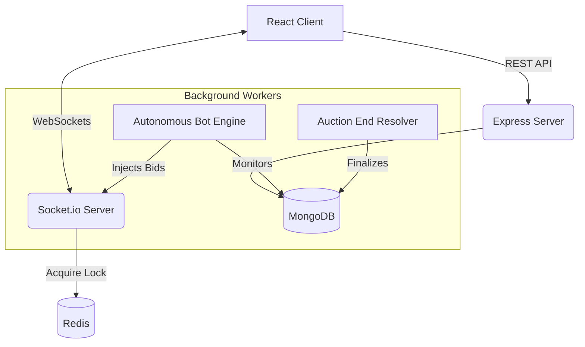

# Creator Flow 🚀


Real-time MERN marketplace for creators featuring zero-latency WebSockets, AI automation, and a secure transaction ledger.

## ✨ Features

- **Real-Time Bidding**: Powered by `Socket.io`, bids are broadcasted instantly to all connected clients in the room without page refreshes.
- **Autonomous AI Bots**: A backend `BotEngine` dynamically monitors active auctions and deploys simulated AI buyers (e.g., *CryptoWhale*, *DubaiPrince*) to compete with human players based on randomized aggression thresholds.
- **Anti-Sniper Protection**: Any bid placed within the last 30 seconds of an auction automatically extends the timer by 2 minutes, ensuring fair price discovery.
- **Optimistic Wallet Sync**: Bidder wallet balances are dynamically deducted and refunded via WebSocket events in real-time.
- **Concurrent Locking**: Redis-backed distributed locks (`lock:auction:{id}`) prevent race conditions if multiple users attempt to bid on the exact same millisecond.

## 🏗️ Architecture



## 🚀 Quick Start (Local Development)

### 1. Clone the repository
```bash
git clone https://github.com/ChinmayPatil00/AuctionEngine.git
cd AuctionEngine
```

### 2. Setup the Backend
```bash
cd backend
npm install
```
Create a `.env` file in the `backend` directory (refer to `.env.example`).
```bash
npm start
```

### 3. Setup the Frontend
Open a new terminal window.
```bash
cd frontend
npm install
npm run dev
```

## 🌐 Production Deployment
- **Frontend**: Deployed on Vercel. 
- **Backend**: Containerized Web Service on Render.
- **Database**: MongoDB Atlas.
- **Cache**: Redis Cloud.
